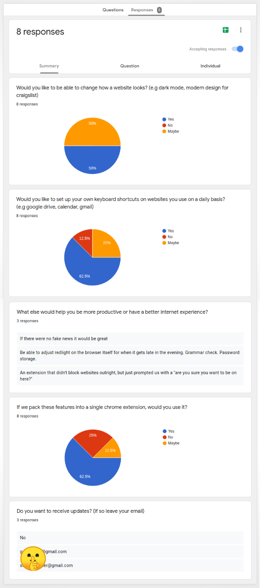

I think we all make the mistake of building a product only to discover later down the road that our idea wasn't worth pursuing.
Especially when you're a dev, building the product is the most satisfying part of the project. But it's not the right way to start it.

Before doing anything else, we need to figure out if our idea is even worth spending more time and energy on it.

It can be simple to do, but there are a few things you need to be aware of.

# Lie to me

I use to think that the easiest way to validate my ideas was to ask my friends and family.

WRONG!!!

Your surrounding always fall into these two categories:
* those who think your ideas are always crap
* and those who think your ideas are always awesome

They rarely believe what they say. And that's absolutely normal, they're biased.

You should never based your decisions on the feedback of people you know.

# A simple and generic method

There's a more objective and generic way of collecting feedback.

## Step 1 - Create a form

Just create a simple form (google forms, typeform,...). But there are some important rules to follow:
* make every question optional (any participation, even incomplete, is welcome);
* ask for email at the end if they to be updated (again, should be optional);
* make your questions as open as possible, but not so much that answering becomes annoying (e.g ~~"What's your biggest pain?"~~ => "What do you hate about reading blog posts?")

## Step 2 - Post your form online
Find relevant forums to post your form in ([reddit](https://reddit.com), [indiehackers](https://indiehackers.com)). Keep your message short and avoid making a sale's pitch. Be as transparent as possible and show empathy.

> "I'm looking to start a new side project. I have some technical skills and I'm interested by X. 
So I thought I could build something that can help us all. Could you please take a second to answer a few questions to let me know how I can help the most.
> All questions are optional and I don't need your personal info."

# Is your idea worth it?

Pick a metric and a threshold beyond which you'll pursue your idea, beforehand.
If people get excited about your idea and leave you their email address, you might be onto something. 

If you haven't passed that threshold, and don't see any traction, it might be wiser to forget about it and find something new.

# Example

A few weeks ago, I had a project idea. A chrome extension to apply custom styles to any website (e.g dark mode in google drive), and custom keyboard shortcuts.
I tried the method above to see if anyone would use it:

<iframe width="560" height="315" src="https://www.youtube.com/embed/5a50khfvGcs" frameborder="0" allow="accelerometer; autoplay; encrypted-media; gyroscope; picture-in-picture" allowfullscreen></iframe>

Results:

To be honest I was surprised to have a few emails and that many answers for a first try.

However my threshold was 20 positive answers. I only got 5, and the idea doesn't seem to sink in.

It's a NO for this one, but I'm glad I haven't spend weeks to build it and realize too late that nobody wants it.

# Conclusion

Validating your idea this way might save you weeks of effort, time and even money.

The chrome extension idea was in my head for a while and to be honest I thought it was a pretty good idea.

*Disclaimer: take this method with a pinch of salt. Nothing can guarantee you 100% if you're idea is worth it. 
I think false negatives and false positives are pretty frequent when it comes to idea validation (cf Airbnb, Facebook, WeWork). This method is just meant to help you make a decision.*